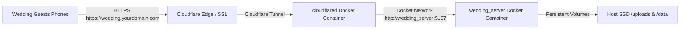

# 🌐 Cloudflare Tunnel & Docker Deployment Guide (Ubuntu)

This guide walks you through deploying your Wedding Photo Server in Docker on Ubuntu and exposing it to your custom domain via your existing **Cloudflare Tunnel (`cloudflared`)** container.

---

## 🏗️ Architecture



---

## Step 1: Clone or Copy Repo to Ubuntu Server

```bash
git clone https://github.com/JRoetscyber/QR_photo_upload.git /opt/wedding-photos
cd /opt/wedding-photos
```

---

## Step 2: Connect Docker Networks

Make sure both the `cloudflared` container and `wedding_server` share the same Docker network.

### Option A: Connect to your existing Cloudflare network
If your existing `cloudflared` container is on a network (e.g. `cloudflare_net`):
1. Open `docker-compose.yml`:
```yaml
version: '3.8'

services:
  wedding_server:
    build: .
    container_name: wedding_server
    restart: unless-stopped
    environment:
      - PORT=5167
      - ADMIN_PIN=2026
    volumes:
      - ./uploads:/app/uploads
      - ./data:/app/data
    networks:
      - cloudflare_net

networks:
  cloudflare_net:
    external: true
```

2. Start the container:
```bash
docker compose up -d --build
```

---

## Step 3: Configure Cloudflare Tunnel

### If using Cloudflare Tunnel `config.yml` file:
Add the ingress rule for your wedding subdomain (e.g. `wedding.yourdomain.com` or `photos.yourdomain.com`):

```yaml
tunnel: <YOUR-TUNNEL-UUID>
credentials-file: /etc/cloudflared/<YOUR-TUNNEL-UUID>.json

ingress:
  # 💍 Wedding Photo App Route:
  - hostname: wedding.yourdomain.com
    service: http://wedding_server:5167

  # Catch-all rule (always last)
  - service: http_status:404
```

Then restart your `cloudflared` container:
```bash
docker restart cloudflared
```

---

### If using Cloudflare Zero Trust Web Dashboard:
1. Go to **Cloudflare One / Zero Trust Dashboard** $\rightarrow$ **Networks** $\rightarrow$ **Tunnels**.
2. Click on your active Tunnel $\rightarrow$ **Configure**.
3. Under **Public Hostname**, click **Add a public hostname**:
   - **Subdomain**: `wedding` (or `photos`)
   - **Domain**: `yourdomain.com`
   - **Type**: `HTTP`
   - **URL**: `wedding_server:5167`
4. Click **Save hostname**.

---

## Step 4: Generate Your Wedding Table QR Code with Your Domain

Now that your site has a real HTTPS domain, generate high-resolution QR codes that point directly to your domain:

```bash
python generate_qr.py --url https://wedding.yourdomain.com
```

This will automatically generate:
- `wedding_qr.png` (high-res QR code pointing to `https://wedding.yourdomain.com`)
- `table_stand_card.html` (printable 4x6 table card with your domain)
- Terminal ASCII QR preview for instant testing!
